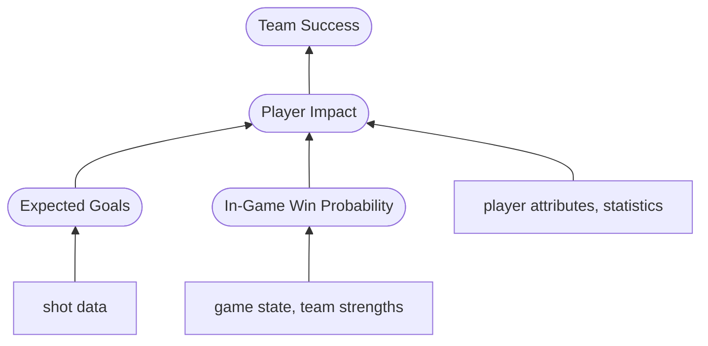

# Hockey Analytics

[](https://opensource.org/licenses/MIT)

## Project Description

The goal of this project is to apply data-based analysis to an unsolved and difficult problem, which I am intimately familiar with: evaluating ice hockey. Due to the reasons described below, I believe hockey analytics models require more feature engineering and domain knowledge than data analysis in many other sports. As someone who has played hockey my entire life, and paid attention to the team development aspects of the NHL, I feel I have acquired domain knowledge that I am excited to apply to this problem. Through this project, I hope to learn lessons about data visualization, analysis methods and techniques along the way, as well as revealing some interesting, and possibly unexpected, insights about the game I love.

Hockey is unique among popular professional sports due to a combination of several factors:
- The degree of flow (there are relatively few stoppages or clearly demarcated events that can be used as data points)
- How strongly randomness can affect the outcome of games (games are decided by relatively low scores)
- The domain of legal player actions is huge
    - Precise and complex manipulation of the playing object (puck)
    - Few restrictions in allowable actions
- Continusous substitution of players during game play

Although these characteristics also apply to other sports, no other sport incorporates all of them. For example, both baseball and American football have continuous play of only a few seconds on average, whereas the time between whistles in hockey is normally on the order of minutes. Football (soccer) has nearly continuous play, but the rules and equipment limit the domain of possible actions players can take. I know relatively little about cricket, but I believe its format and restrictions are similar to baseball, at least regarding the characteristics listed. 

Furthermore, compounding effects strongly impact team performance. For example, the way player skill sets complement each other has a significant effect on a unit's impact, but analyzing this is confounded by the constant substitution of players. The number of player combinations on the ice together in a single game is greater than in any other sport. Assigning credit is also difficult in hockey. Single events rarely come to fruition solely through the actions of a single player. In most cases, four to six players contribute to any one event. Even defining and separating events is challenging due to the degree of flow in game play. The combination of these factors make hockey a uniquely challenging sport in which to gather useful data and to evaluate analytically. 


## Project Outline

### Setting up the environment

The repo includes a setup.py file that allows the project to be installed locally as a package. Alternatively, there is an environment file that may be used to create a conda environment in which the project may be run.
TODO: include code snippets describing what commands to run to perform either of the above operations


### List of packages and directories

nhl_api (package): series of modules containing functions used to retrieve, parse, and reformat the data from NHL.com's API

api_scripts (directory): contains scripts used to pull game data from NHL.com's API. The data is retrieved in JSON format and parsed to python dictionaries before being stored as .csv files. Also contains a series of scripts used to clean and reformat the data, readying it to be stored in a database.

nhl_database (package): series of modules containing functions used to create a postgresql database in a Docker container, then populate it with the reformatted data from the NHL API

analyses (directory): collection of notebooks in which exploratory data analyses (EDAs) are performed on data retrieved from the database using SQL query functions defined in the nhl_database package

models (package): series of modules containing functions used to define the models which are the primary product of this project

model_output (directory): collection of scripts and notebooks in which the models are trained and tested


### Extracting the data from NHL.com
TODO: include commands required to pull and format data


### Creating the database

Once the data is reformatted and stored as .csv files in the directory `Hockery-Analytics/data/`, run these commands from `Hockey-Analytics/nhl_database/`

```shell
    docker compose up -d
    
    python3 db_create_sqla_core.py
```

Where the username, password and database name postgres environment variables are retrieved from a .env file. The username and password are important for connecting to the database through a database tool such as DBeaver. Since the database is hosted locally, and there is nothing sensitive on it, I have used a generic username and password combination.


### Exploratory Data Analyses

These jupyter notebooks illustrate patterns and trends in the data, to identify interesting features and guide the model design process. Descriptions of particular analyses will be added here as they are completed.

#### Shot EDA
TODO: Add description of the analysis


### Modelling

#### Model Architecture

Note: Models have round ends, input features are in rectangles


#### Model Descriptions
Add descriptions of each model (including inputs/outputs, model use, and thought process/notes)

In-Game Win Probability: Evaluates the probability a team will win a particular game given the current game state (score, time, etc...). The first version of the model is simply based on historical outcomes. Later, team strengths will be included as inputs to improve performance. Used to determine whether individual players normally impact the game during important moments, or collect points when the outcome of the game is no longer in question.

Expected goals (xG): Evaluates the offensive contributions of a player or team by aggregating the number and effectiveness of scoring opportunities they create. Shots are approximately 15 times more common than goals (i.e. "scoring events"). Therefore, using shots to measure player or team contributions provides many more data points for training the impact model. Expected goals are used to help determine the impact of a player on a game, both offensively (xG created) and defensively (xG allowed), or the strength/style of a team. Whether players or teams consistently outperform their expected goal totals is an indication of the individual player's or team's talent. Consistent differences between xG and actual goals scored also indicates that the model is not capturing all important information.

Player impact: Evaluates the overall impact of a player on an individual game. This takes into account the player's average scoring/defensive contributions, as well as their tendency to contribute at important times. It is an open question in the analytics community what player attributes most strongly influence team success (i.e. winning games). Therefore, the player impact model is the key cog in this pipeline, and will likely evolve the most throughout the modelling process.

Team success: Evaluates the probability that a team will win individual games. This may be used to predict success across seasons by sequentially predicting all the games in a season and taking the cumulative result. On the other hand, a second model may be used to predict team success over longer time frames, based on team attributes. Both models will depend on the aggregation of individual player contributions, as well as how the mix of player attributes affects the overall team effectiveness. The cumulative model will also have a temporal aspect, accounting for recent success (momentum), travel, etc...
